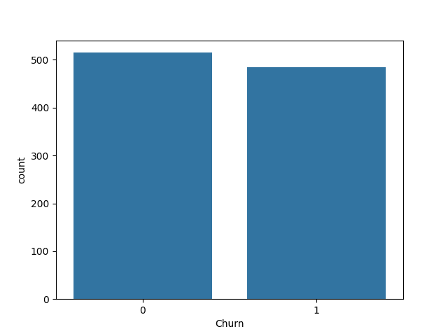

# Customer Churn Prediction



## Overview

Customer churn is a critical challenge for subscription-based businesses. Predicting which customers are likely to churn and implementing targeted retention strategies can significantly impact business profitability. This project aims to develop machine learning models to predict customer churn and enable targeted retention strategies, ultimately reducing the churn rate by 12%.

## Table of Contents

- [Introduction](#customer-churn-prediction)
- [Overview](#overview)
- [Features](#features)
- [Installation](#installation)
- [Usage](#usage)
- [Data](#data)
- [Models](#models)
- [Results](#results)
- [Contributing](#contributing)
- [License](#license)

## Features

- **Exploratory Data Analysis (EDA):** Gain insights into customer behavior and churn patterns.
- **Feature Engineering:** Create new features to improve model performance.
- **Model Building:** Develop predictive models using logistic regression, decision trees, random forests, support vector machines, and gradient boosting.
- **Hyperparameter Tuning:** Optimize model performance through hyperparameter tuning techniques.
- **Cross-Validation:** Assess model performance using cross-validation techniques.
- **Targeted Retention Strategies:** Implement strategies to retain customers at risk of churn.

## Installation

1. Clone the repository:
    ```bash
    git clone https://github.com/your-username/customer-churn-prediction.git
    cd customer-churn-prediction
    ```

2. Create a virtual environment and activate it:
    ```bash
    python -m venv venv
    source venv/bin/activate  # For Unix-based systems
    venv\Scripts\activate     # For Windows
    ```

3. Install the required packages:
    ```bash
    pip install -r requirements.txt
    ```

## Usage

1. **Prepare Data**: 
    ```bash
    python src/prepare_data.py
    ```

2. **Generate Synthetic Data** (if needed):
    ```bash
    python src/generate_data.py
    ```

3. **Perform EDA**: 
    ```bash
    python src/eda.py
    ```

4. **Feature Engineering**: 
    ```bash
    python src/feature_engineering.py
    ```

5. **Model Building**:
    ```bash
    python src/model_building.py
    ```

6. **Model Validation**:
    ```bash
    python src/model_validation.py
    ```

7. **Hyperparameter Tuning**:
    ```bash
    python src/hyperparameter_tuning.py
    ```

8. **Model Training and Evaluation**:
    ```bash
    python model_training_and_evaluation.py
    ```

## Data

- **Original Data**: `data/prepared_customer_data.csv`
- **Synthetic Data**: `data/synthetic_customer_data.csv`
- **Train/Test Splits**: 
    - Training data: `data/X_train.csv`, `data/y_train.csv`
    - Test data: `data/X_test.csv`, `data/y_test.csv`
    - Polynomial features: `data/X_train_poly.csv`, `data/X_test_poly.csv`

## Models

The project implements several machine learning models for customer churn prediction:

- Logistic Regression
- Decision Trees
- Random Forests
- Support Vector Machines (SVM)
- Gradient Boosting

## Results

### Model Performance Summary

- **Logistic Regression**: 50.3%
- **Decision Tree**: 47.7%
- **Random Forest**: 50.7%
- **Support Vector Machine (SVM)**: 52.7%
- **Gradient Boosting**: 53.0%


## Figures

The `figures/` directory contains visualizations generated during the EDA phase, such as:
- `Figure_1-CHURN.png`: Distribution of churned vs non-churned customers.
- `Figure_2-CORRELATION-MATRIX.png`: Correlation matrix of features.

## Contributing

Contributions are welcome! Please fork the repository and create a pull request with your proposed changes.

## License

This project is licensed under the MIT License. See the [LICENSE](LICENSE) file for details.

